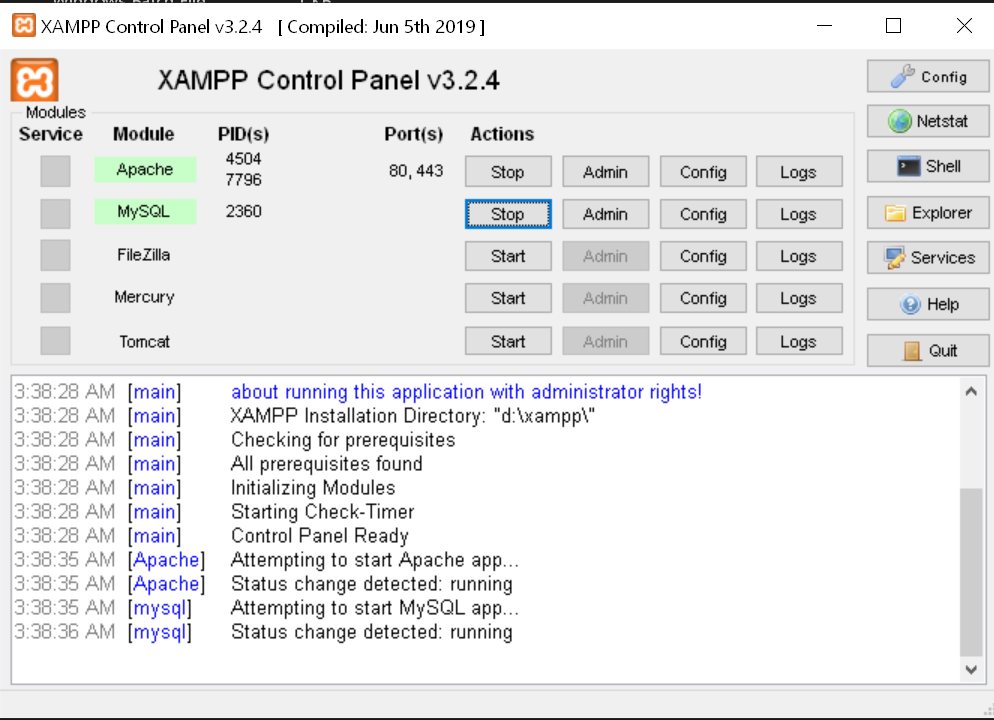

# Restaurant Reservation System

---

## Setup:

1. Make sure to install XAMPP first. [Link here](https://www.apachefriends.org/index.html)
    
2. After Installing XAMPP, extract the zipped file and put the project inside of XAMPP's root directory **"C:\xampp\htdocs\\"**
    
3. Open XAMPP Control Panel and start the APACHE and MySQL
   
    
4. Open your browser and type http://localhost/crud-restaurant-reservation-system/
   
    
   You should see the home page
   
    

   If you navigate to Reservation tab, you will se an error like this. It's okay, we just need to create the database for our app to fix it.
   
    

5. Open a new tab and go to **"http://localhost/phpmyadmin/"**
   

6. Click "New" to create a new database named **"db_reservation-system"**
   
    

7. If you go back to the [reservation page](http://localhost/crud-restaurant-reservation-system/reservation.php), there should be no error now
   
    

   Now, Let's try to add a new customer reservation, just fill up the Customer Reservation Form and click "Submit"
    

8. You should get an error saying _"Table 'db_reservation-system.customers' doesn't exist"_. We can easily fix that by importing the tables from the project's sql file.
    
   Go to the database that we've just created earlier and click on the Import tab and import "**db_reservation-system.sql**" file from the project's folder.
   
    
   
    
   
    

9. After importing the tables, go back to the [reservation page](http://localhost/crud-restaurant-reservation-system/reservation_process.php) and login as an admin. Use the credentials below:
    
   username: admin
   password: 1234
    
   You should see the newly added reservation record
   
    

10. That's it!!! You've just run the project in your machine
